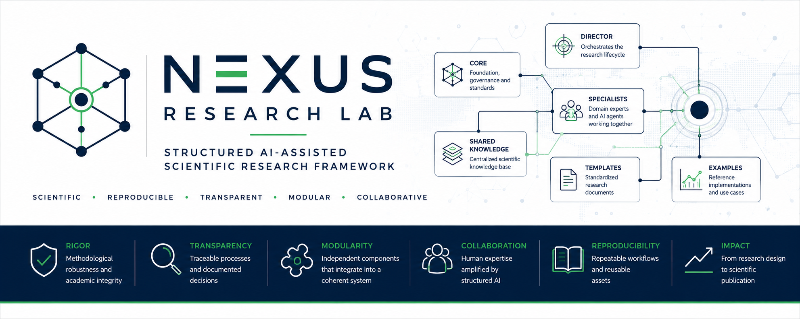
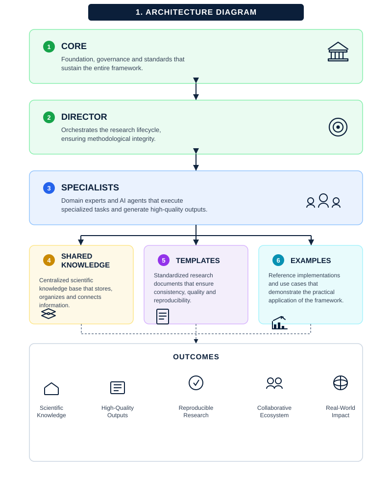
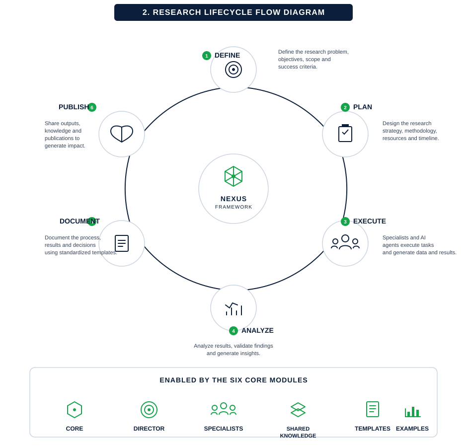

<p align="center">



</p>

<h1 align="center">

NEXUS Research Lab

</h1>

<p align="center">

<b>Framework estructurado para investigación científica asistida por Inteligencia Artificial</b>

</p>

<p align="center">

Transformando modelos conversacionales de IA en un laboratorio científico organizado, transparente y reproducible.

</p>

---

## Idiomas

🇪🇸 Español (documentación actual)

🇺🇸 [English](README.md)

---

# ¿Qué es NEXUS Research Lab?

NEXUS Research Lab (NRL) es un framework documental y metodológico diseñado para organizar proyectos de investigación científica asistidos por modelos de Inteligencia Artificial.

En lugar de utilizar un modelo de lenguaje como un simple asistente conversacional, NEXUS establece una arquitectura completa de investigación donde cada etapa del proceso científico posee objetivos, responsabilidades, documentación y criterios de calidad claramente definidos.

El framework no reemplaza al investigador.

Su propósito es proporcionar estructura, trazabilidad y gobernanza al proceso de investigación.

---

# ¿Qué problema resuelve?

Los modelos actuales de Inteligencia Artificial son capaces de generar textos científicos con gran rapidez.

Sin embargo, una investigación no consiste únicamente en redactar documentos.

Una investigación rigurosa requiere:

- planificación;
- metodología;
- revisión científica;
- control de calidad;
- verificación de integridad;
- preparación editorial;
- documentación reutilizable;
- trazabilidad de decisiones.

Cuando todo este proceso se desarrolla mediante conversaciones independientes con una IA, resulta difícil mantener consistencia metodológica y documentación organizada.

NEXUS organiza todo ese proceso dentro de una arquitectura reutilizable.

---

# ¿Qué hace NEXUS?

NEXUS transforma un proyecto de investigación en un flujo estructurado compuesto por módulos especializados.

Cada componente del framework tiene una responsabilidad claramente definida.

Esto permite que el proyecto avance de forma ordenada desde la idea inicial hasta la preparación del paquete final de publicación científica.

---

# Características principales

✔ Arquitectura modular.

✔ Director que coordina el proceso completo.

✔ Especialistas con responsabilidades independientes.

✔ Documentación estandarizada.

✔ Flujo editorial.

✔ Revisión científica integrada.

✔ Auditoría de integridad.

✔ Plantillas reutilizables.

✔ Ejemplos completamente documentados.

✔ Independencia del modelo de IA utilizado.

---

# Estructura general del repositorio

```text
NEXUS_Research_Lab/

│

├── 01_CORE

├── 02_DIRECTOR

├── 03_SPECIALISTS

├── 04_SHARED_KNOWLEDGE

├── 05_TEMPLATES

├── 06_EXAMPLES

└── 07_BRANDING
```

---

# Arquitectura

<p align="center">



</p>

NEXUS organiza la investigación mediante una arquitectura por capas.

Cada módulo posee una función específica y puede evolucionar de manera independiente sin afectar el resto del framework.

Esta separación facilita el mantenimiento, la escalabilidad y la futura automatización mediante sistemas multiagente.

---

# Flujo general de investigación

<p align="center">



</p>

Todo proyecto desarrollado con NEXUS sigue un flujo metodológico común:

Idea

↓

Planeación

↓

Investigación

↓

Redacción científica

↓

Revisión

↓

Auditoría

↓

Preparación editorial

↓

Publicación

↓

Mejora continua

---

---

# Arquitectura del Framework

NEXUS Research Lab está organizado en siete módulos principales.

Cada uno representa una capa de responsabilidad dentro del laboratorio de investigación.

| Carpeta | Propósito |
|----------|-----------|
| **01_CORE** | Fundamentos, filosofía, gobernanza y arquitectura del framework. |
| **02_DIRECTOR** | Orquestación del proceso de investigación y coordinación de especialistas. |
| **03_SPECIALISTS** | Especialistas encargados de ejecutar tareas científicas específicas. |
| **04_SHARED_KNOWLEDGE** | Conocimiento institucional reutilizable, metodologías y estándares. |
| **05_TEMPLATES** | Plantillas oficiales para garantizar uniformidad documental. |
| **06_EXAMPLES** | Casos de ejemplo completamente documentados. |
| **07_BRANDING** | Identidad visual y activos gráficos institucionales. |

---

# ¿Cómo funciona NEXUS?

A diferencia de un chat tradicional con IA, NEXUS divide el proceso de investigación en etapas independientes.

Cada etapa tiene:

- un objetivo específico;
- un responsable claramente definido;
- entradas esperadas;
- productos de salida;
- criterios mínimos de calidad.

El Director coordina el flujo de trabajo y determina cuándo cada especialista debe intervenir.

Este enfoque reduce la improvisación y permite construir investigaciones mucho más consistentes y fáciles de revisar.

---

# ¿Cómo empezar a utilizar NEXUS?

Si es la primera vez que utilizas el framework, se recomienda seguir exactamente este orden.

## Paso 1

Clona el repositorio.

```bash
git clone https://github.com/IngDavidMurcia/nexus-research-lab.git
```

---

## Paso 2

Lee primero la documentación base.

```text
01_CORE

↓

02_DIRECTOR
```

Estos documentos explican la filosofía, la arquitectura y el funcionamiento general del framework.

No se recomienda comenzar directamente por los especialistas.

---

## Paso 3

Comprende el papel del Director.

El Director es el componente que coordina todo el proceso.

No es un especialista.

No redacta artículos.

No revisa publicaciones.

Su función consiste en decidir:

- qué especialista debe intervenir;
- cuándo debe hacerlo;
- qué información necesita;
- cuándo una fase puede darse por terminada.

---

## Paso 4

Conoce a los especialistas.

Cada especialista representa una función habitual dentro de un laboratorio de investigación.

Por ejemplo:

- Arquitecto de investigación.
- Escritor científico.
- Revisor científico.
- Especialista en publicaciones.
- Auditor de calidad.

Cada uno trabaja únicamente dentro de su ámbito de responsabilidad.

---

## Paso 5

Consulta el conocimiento compartido.

Antes de ejecutar un proyecto revisa la carpeta:

```text
04_SHARED_KNOWLEDGE
```

Allí encontrarás:

- metodologías;
- estándares editoriales;
- lineamientos para IA;
- normas de citación;
- flujo de publicaciones.

Estos documentos sirven como referencia común para todos los especialistas.

---

## Paso 6

Utiliza las plantillas.

La carpeta:

```text
05_TEMPLATES
```

contiene documentos reutilizables para cada etapa del proceso.

No es necesario comenzar desde cero en cada investigación.

---

## Paso 7

Estudia un proyecto completo.

Finalmente, revisa:

```text
06_EXAMPLES
```

Los ejemplos muestran cómo interactúan todos los componentes del framework en un caso real.

Se recomienda recorrer el ejemplo completo antes de iniciar un proyecto propio.

---

# Flujo recomendado de uso

```text
Leer CORE

↓

Comprender DIRECTOR

↓

Conocer SPECIALISTS

↓

Revisar SHARED KNOWLEDGE

↓

Utilizar TEMPLATES

↓

Estudiar EXAMPLES

↓

Iniciar un proyecto propio
```

Este recorrido permite comprender progresivamente la arquitectura antes de comenzar a utilizarla.

---

# Compatibilidad con modelos de IA

NEXUS no depende de un proveedor específico.

Puede utilizarse con:

- ChatGPT
- Gemini
- Claude
- Copilot
- DeepSeek
- Qwen
- Mistral
- otros modelos compatibles

El framework está diseñado para mantenerse vigente independientemente de la evolución de los modelos de lenguaje.

---

---

# Buenas prácticas y errores comunes

El éxito al utilizar NEXUS Research Lab depende tanto de comprender su arquitectura como de seguir una metodología de trabajo consistente.

Las siguientes recomendaciones ayudan a aprovechar al máximo el framework.

---

## Buenas prácticas

### ✓ Lee la documentación en orden

Respeta la secuencia propuesta por el framework.

```text
01_CORE

↓

02_DIRECTOR

↓

03_SPECIALISTS

↓

04_SHARED_KNOWLEDGE

↓

05_TEMPLATES

↓

06_EXAMPLES
```

Cada módulo fue diseñado para construir conocimiento sobre el anterior.

---

### ✓ Utiliza siempre al Director como punto de entrada

El Director es el componente encargado de coordinar el flujo de trabajo.

No interactúes directamente con los especialistas sin que el Director haya definido el contexto y el objetivo de la tarea.

---

### ✓ Mantén separados los productos generados

Cada especialista produce documentos diferentes.

Evita combinar varias etapas del proceso en un único archivo o conversación.

Esta separación facilita la revisión, reutilización y trazabilidad del proyecto.

---

### ✓ Conserva el historial del proyecto

Guarda los documentos producidos en cada fase.

La fortaleza de NEXUS radica en que el proceso completo puede reconstruirse y auditarse posteriormente.

---

### ✓ Utiliza las plantillas oficiales

Las plantillas garantizan uniformidad documental y reducen el tiempo necesario para iniciar nuevos proyectos.

Siempre que sea posible, evita crear documentos desde cero.

---

### ✓ Documenta las decisiones importantes

Cuando una decisión metodológica modifique el rumbo del proyecto, deja constancia de ella.

Esto facilita futuras revisiones y mejora la reproducibilidad de la investigación.

---

# Errores comunes

### ✗ Intentar utilizar todo el repositorio simultáneamente

No cargues todos los documentos en una sola conversación con un modelo de IA.

NEXUS fue diseñado como un sistema modular.

Cada fase utiliza únicamente la información necesaria para esa etapa.

---

### ✗ Omitir la lectura del CORE

El módulo **01_CORE** contiene la filosofía y las reglas fundamentales del framework.

Saltarlo suele producir un uso incorrecto del resto de los componentes.

---

### ✗ Trabajar directamente con un especialista

Los especialistas no sustituyen al Director.

Su intervención debe formar parte de un flujo de trabajo coordinado.

---

### ✗ Esperar que la IA tome decisiones científicas

NEXUS no automatiza el juicio científico.

Las decisiones metodológicas, éticas y académicas continúan siendo responsabilidad del investigador.

---

### ✗ Utilizar NEXUS como una colección de prompts

El framework no es un repositorio de instrucciones aisladas.

Es una arquitectura metodológica donde cada componente depende del contexto generado por los anteriores.

---

### ✗ Modificar documentos oficiales sin control

Si adaptas plantillas, metodologías o estándares institucionales, documenta los cambios realizados.

Esto facilita el mantenimiento y evita inconsistencias entre proyectos.

---

# Preguntas frecuentes

## ¿Necesito utilizar todos los especialistas?

No.

Cada proyecto puede requerir un subconjunto diferente de especialistas.

El Director determina cuáles son necesarios según los objetivos de la investigación.

---

## ¿Puedo utilizar otro modelo de IA?

Sí.

NEXUS es independiente del proveedor de Inteligencia Artificial.

Puede utilizarse con cualquier modelo de lenguaje que permita trabajar mediante instrucciones estructuradas.

---

## ¿NEXUS genera automáticamente artículos científicos?

No.

NEXUS proporciona una metodología para organizar el proceso de investigación.

La calidad del resultado depende de la información disponible, del criterio del investigador y de la correcta aplicación del framework.

---

## ¿Puedo adaptar el framework a otra disciplina?

Sí.

Aunque fue concebido inicialmente para investigación científica asistida por IA, la arquitectura modular permite adaptarlo a otros procesos de generación de conocimiento estructurado.

---

## ¿Es necesario utilizar todas las plantillas?

No.

Las plantillas son un punto de partida recomendado.

Cada institución o grupo de investigación puede adaptarlas según sus necesidades.

---

# Visión del proyecto

NEXUS Research Lab busca convertirse en una plataforma metodológica para la investigación científica asistida por Inteligencia Artificial.

Su propósito no es reemplazar al investigador, sino ofrecer una estructura organizada que permita integrar modelos de lenguaje en procesos de investigación rigurosos, transparentes y reproducibles.

La visión de largo plazo contempla la evolución del framework hacia una plataforma colaborativa, interoperable y abierta a la comunidad científica internacional.

---

# Autor

**David Murcia**

Investigador · Ingeniero · Desarrollador

Proyecto desarrollado como iniciativa para fortalecer metodologías de investigación científica asistidas por Inteligencia Artificial.

---

# Licencia

Este proyecto se distribuye bajo la licencia **MIT**.

Consulta el archivo `LICENSE` para más información.

---

# ¡Bienvenido a NEXUS!

Si este framework contribuye a tus proyectos de investigación, considera compartir tus mejoras, casos de uso o sugerencias mediante el repositorio oficial.

La colaboración abierta es uno de los pilares sobre los que NEXUS continuará evolucionando.