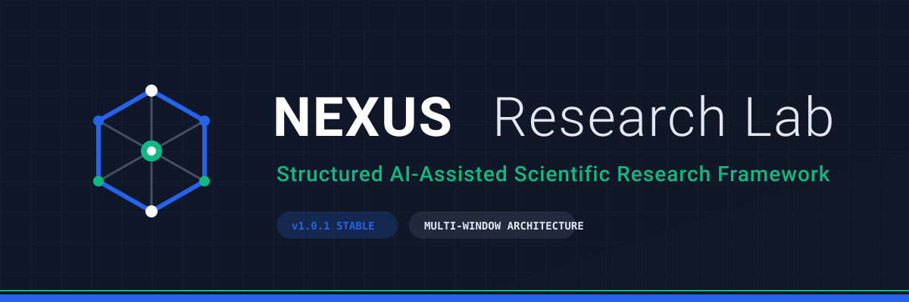
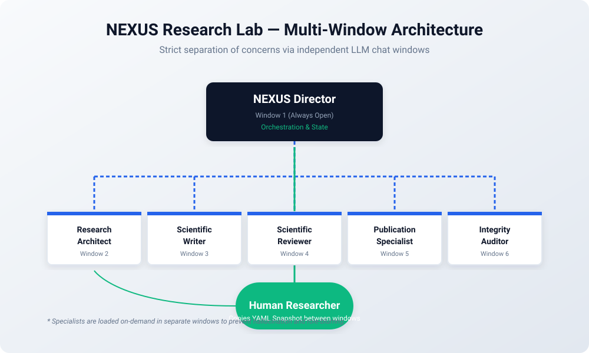
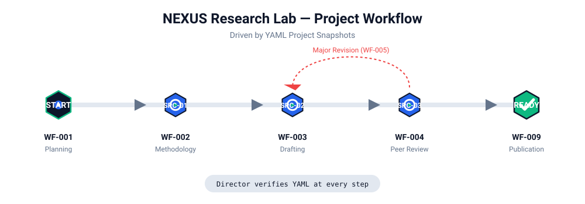

  

  <b>Bringing scientific governance to AI-assisted research.</b>

  
  
  
  

---

## 🌐 Languages
- 🇺🇸 English (Current)
- 🇪🇸 [Español](LEEME.md)

---

## What is NEXUS Research Lab?

**NEXUS Research Lab** is a structural framework designed for academic researchers who want to use Artificial Intelligence (LLMs like ChatGPT, Gemini, or Claude) to assist their research, without sacrificing **scientific rigor, traceability, or ethical integrity.**

Rather than treating AI as a "magic chat" that writes a paper in one click (which leads to hallucinations and poor methodology), NEXUS forces the AI to operate as a **laboratory of strict, isolated specialists**. 

### The Core Problem
When you ask an AI to "write a scientific paper," it blends roles: it tries to be the researcher, the writer, and the reviewer all at once. This degrades its attention span and leads to fabricated references and weak science.

### The NEXUS Solution: Multi-Window Architecture
NEXUS solves this by imposing a **Multi-Window Protocol**. The researcher acts as the bridge between isolated AI agents.

  

1. **The Director**: Orchestrates the project, validates rules, and maintains the project state in a YAML file.
2. **The 5 Specialists**: They do the actual work (Methodology, Writing, Reviewing, Publishing, Auditing). They are loaded *only when needed* in completely separate chat windows.

---

## How it Works (The Workflow)

NEXUS does not require you to install any Python code or local databases. It is entirely prompt-driven and runs directly in your favorite AI chat interface. It achieves state persistence by passing a **Project Snapshot (YAML)** back and forth.

  

1. **Initialize**: You load the Director in Window 1.
2. **Delegate**: The Director tells you to consult the Research Architect.
3. **Execute**: You open Window 2, load the Architect, and paste the YAML.
4. **Return**: The Architect gives you an updated YAML, which you paste back to the Director in Window 1.

---

## 🚀 Getting Started

You can run NEXUS on any modern LLM (GPT-4o, Claude 3.5 Sonnet, Gemini 1.5 Pro). We have compiled the entire architecture into 8 easy-to-use Markdown files located in the `DISTRIBUTION/COMPILED/` folder.

Choose your preferred AI platform to see the setup guide:
- 📘 [ChatGPT Installation Guide](DISTRIBUTION/COMPILED/INSTALL_ChatGPT.md)
- 📙 [Claude Installation Guide](DISTRIBUTION/COMPILED/INSTALL_Claude.md)
- 📗 [Gemini Installation Guide](DISTRIBUTION/COMPILED/INSTALL_Gemini.md)
- 📓 [Universal Guide (Other LLMs)](DISTRIBUTION/COMPILED/INSTALL_Universal.md)

Or download the complete ready-to-use bundle:  
📦 [**Download NEXUS v1.0.1 Release Bundle**](DISTRIBUTION/NEXUS_Runtime_v1.0.1.zip)

---

## 🏛️ The Specialists

The compiled package includes the following roles:

| ID | Role | Function |
|---|---|---|
| **DIR** | `Director` | Orchestrates the workflow and maintains the YAML state. |
| **SPC-01** | `Research Architect` | Designs the methodology, hypotheses, and variables. |
| **SPC-02** | `Scientific Writer` | Drafts the manuscript strictly following the architecture. |
| **SPC-03** | `Scientific Reviewer` | Simulates rigorous peer review (Accept/Reject/Revise). |
| **SPC-04** | `Publication Specialist` | Formats for specific journals and creates submission packages. |
| **SPC-05** | `Integrity Auditor` | Checks for hallucinations, ethics, and AI transparency. |

---

## 🤝 Contributing

NEXUS is an open-source initiative to improve the quality of AI-assisted science globally.

If you are a **technical developer**, **prompt engineer**, or **specialized researcher** who wants to add new custom specialists (e.g., a Statistical Modeler plugin), please refer to our [**Contributing Guidelines**](CONTRIBUTING.md) and the [**Plugin Standard**](DISTRIBUTION/COMPILED/PLUGIN_STANDARD.md).

## License

This project is licensed under the MIT License - see the LICENSE file for details.
